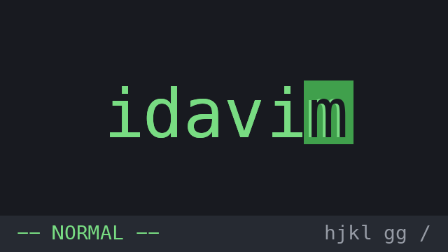

# idavim

<p align="center">
  
</p>

[English](README.md) | **한국어**

[Vimium](https://github.com/philc/vimium)과 [IdeaVim](https://github.com/JetBrains/ideavim)에서 영감을 받은, IDA Pro용 vim 스타일 키보드 내비게이션 플러그인입니다.

**디스어셈블리 뷰**와 **Hex-Rays 슈도코드 뷰** 양쪽에서 모두 동작합니다.

## 동작 방식

idavim은 단순한 켜기/끄기(on/off) 방식으로 동작합니다:

- **활성화** (기본): 아래 키들을 가로채서 내비게이션에 사용합니다. IDA의 단일 키 단축키(`n` 이름 변경, `d` 데이터, `u` 정의 해제, `g` 주소 이동, `c` 코드 변환, `*` 배열, `#` 숫자 변환 등)보다 우선합니다.
- **비활성화**: 모든 키가 IDA로 그대로 전달되어, IDA 기본 단축키를 평소처럼 사용할 수 있습니다.

| 동작 | 키 |
|---|---|
| 활성화 ↔ 비활성화 토글 | `Shift+Esc` (일반 `Esc`는 IDA "뒤로 가기"로 그대로 동작, Edit → Plugins → idavim으로도 가능) |

토글은 정식 IDA 액션(`idavim: toggle`)으로 등록되어 있어서 Options → Shortcuts에서 키를 바꿀 수 있습니다.

상태가 바뀔 때마다 Output 창에 `[idavim] enabled` / `[idavim] disabled` 메시지가 출력되므로, 현재 상태가 헷갈릴 땐 Output 창을 확인하세요.

키 가로채기는 애플리케이션 레벨 Qt 이벤트 필터로 구현되어 있어서, 다이얼로그·CLI 입력창·기타 텍스트 입력에서는 키를 절대 빼앗지 않습니다 — 리스팅 뷰에서만 동작합니다. 그래프 모드 디스어셈블리에서도 개입하지 않고 모든 키를 IDA에 맡깁니다 (줄 단위 이동이 의미가 없는 화면이라서요).

"Synchronize with"를 켜두면 pseudocode에 연결된 뷰들이 방향키를 눌렀을 때처럼 idavim 이동도 따라옵니다. (IDA의 동기화는 실제 키 입력에만 반응하기 때문에, idavim은 점프 직후 ↓↑를 한 번씩 살짝 눌러 — 커서 순이동 0 — 따라오기는 IDA에게 맡기는 방식입니다.)

## 키 목록 (활성 상태)

### 이동

| 키 | 동작 |
|---|---|
| `h` `j` `k` `l` | 왼쪽 / 아래 / 위 / 오른쪽 |
| `d` / `u` | 반 페이지 아래 / 위 (Vimium 스타일) |
| `gg` / `G` | 리스팅 맨 위 / 맨 아래 (디스어셈블리에서는 데이터베이스 시작 / 끝) |
| `{n}gg` / `{n}G` | n번째 줄로 점프 — 슈도코드 뷰 전용 (예: `3G` → 3번째 줄) |
| `:` | 줄 번호 입력창을 띄워 해당 줄로 점프 (`:30`) — 슈도코드 뷰 전용, 디스어셈블리에서 `:`는 IDA "주석 입력" 그대로 |
| `0` / `^` / `$` | 줄 시작 / 첫 non-blank 문자 / 줄 끝 |
| `w` / `e` / `b` | 다음 단어 시작 / 단어 끝 / 이전 단어 시작 |
| `1`–`9` | 카운트 접두사, 예: `12j`, `3w`, `2d` |

### 찾기 & 검색

| 키 | 동작 |
|---|---|
| `f{문자}` / `F{문자}` | 현재 줄에서 문자를 앞 / 뒤 방향으로 찾기 |
| `;` / `,` | 마지막 `f`/`F` 반복 (같은 / 반대 방향) — `f`/`F`를 한 번 쓰기 전까지는 IDA에 그대로 전달됨 (`;`는 "enter comment") |
| `/` | 검색 (패턴 입력 프롬프트, 대소문자 무시 substring) |
| `n` / `N` | 다음 / 이전 검색 매치로 이동 |
| `*` / `#` | 커서 아래 식별자를 앞 / 뒤 방향으로 검색 (whole-word 매칭이라 `v1`이 `v12`에 걸리지 않음, `/`처럼 대소문자 무시, 이후 `n`/`N`으로 계속) |

슈도코드 뷰에서 `/`는 현재 함수의 전체 라인을 검색하며 끝에 도달하면 처음부터 이어서(wrap-around) 검색합니다.
디스어셈블리 뷰에서는 커서 위치부터 item head 단위로 디스어셈블리 텍스트와 심볼 이름을 검색합니다.

### 액션

| 키 | 동작 |
|---|---|
| `cw` | 커서 아래 식별자 이름 변경 (IDA rename 다이얼로그) |

그 외 모든 키(`Esc`, `Enter`, `x`, `Space`, 방향키 등)는 idavim이 활성화된 상태에서도 IDA로 그대로 전달됩니다. 유일한 예외는 `f`/`F`/`g`/`c` 직후의 키 하나입니다: 인쇄 가능한 키는 해당 명령을 완성하고, 일반 `Esc`는 IDA의 "뒤로 가기"를 발동시키지 않고 명령만 취소합니다 (vim과 동일).

### 명령 조합 규칙

idavim은 vim 에뮬레이터가 아니라 분석용 내비게이션 도구라서, **단일 명령(+ 카운트 접두사)만** 지원합니다:

- **지원**: `카운트 + 이동` (`12j`, `3w`, `2d`), `카운트 + gg/G` (`30G`, 슈도코드 전용), `f{문자}` 후 `;`/`,` 반복
- **미지원**: `카운트 + f/F` (`3fx`는 1번째 매치로만 감 — `f` 후 `;;`를 쓰세요), 오퍼레이터·텍스트 오브젝트 (`dw`, `yy`, `ci(` 등), 마크, 레지스터, 매크로

두 키짜리 명령이 중간에 끊기면 vim과 동일하게 동작합니다: 유효하지 않은 후속 키는 명령을 취소시키고 (`30g` 다음 `3`을 치면 둘 다 버려짐), 다른 위젯으로 포커스가 이동하거나 마우스를 클릭하면 입력 중이던 명령은 폐기됩니다.

## 요구 사항

- IDA Pro 9.0+ (GUI, PySide6 또는 PyQt5 기반 Qt)
- 외부 Python 의존성 없음

## 설치

리포지토리를 클론하고 IDA 플러그인 디렉토리에 심볼릭 링크를 만듭니다:

```sh
git clone https://github.com/hyuunnn/idavim.git
ln -s "$(pwd)/idavim" ~/.idapro/plugins/idavim
```

그 다음 IDA를 재시작하면 됩니다.

## 라이선스

MIT
